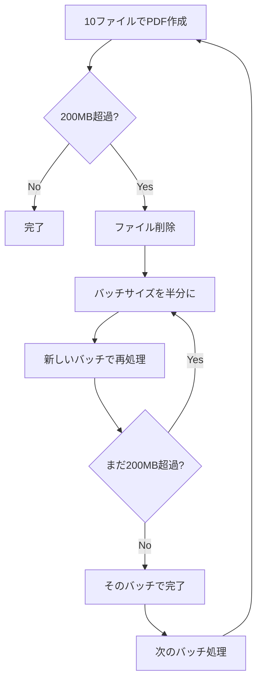

# PNG to PDF 変換ツール - 200MB分割機能 説明書

## 概要

PNG to PDF変換ツールに**200MB自動分割機能**を追加しました。この機能により、大量の画像を変換する際に生成されるPDFファイルが200MBを超える場合、自動的に複数のPDFファイルに分割して保存されます。

## 新機能の詳細

### 1. 自動ファイルサイズ監視
- PDFファイル作成後、自動的にファイルサイズをチェック
- 200MBを超過した場合、自動的に分割処理を実行
- ユーザーの操作は不要（完全自動）

### 2. インテリジェント分割アルゴリズム
- **初期バッチサイズ**: 10ファイルずつ処理
- **動的調整**: 200MB超過時は自動的にバッチサイズを半分に縮小
- **再帰処理**: 必要に応じて1ファイルまで細分化
- **最適化**: メモリ効率とファイル数のバランスを考慮

### 3. ファイル命名規則
```
元のファイル名: "スクリーンショット集"
↓
分割時の命名:
- スクリーンショット集_part1.pdf
- スクリーンショット集_part2.pdf  
- スクリーンショット集_part3.pdf
...
```

**特例**: 分割が不要な場合（10ファイル以下で200MB未満）は、元の名前のまま保存

## 使用方法

### 基本的な使い方
1. **従来通りの操作**: スクリプトを実行してファイル名を入力
2. **自動処理**: システムが自動的にファイルサイズを監視し、必要に応じて分割
3. **結果確認**: 完了ダイアログで作成されたファイル数とサイズを確認

### 実行例

#### 小規模変換（分割なし）
```
入力: 5個のPNGファイル（合計50MB相当）
出力: スクリーンショット集.pdf (45MB)
```

#### 大規模変換（分割あり）
```
入力: 50個のPNGファイル（合計800MB相当）
出力: 
- スクリーンショット集_part1.pdf (195MB)
- スクリーンショット集_part2.pdf (190MB)
- スクリーンショット集_part3.pdf (180MB)
- スクリーンショット集_part4.pdf (160MB)
```

## 技術仕様

### ファイルサイズ計算
- **監視単位**: MB（メガバイト）
- **計算方法**: `stat -f%z` コマンドによるバイト数取得 → MB変換
- **しきい値**: 200MB（設定可能）

### 分割処理フロー


### エラーハンドリング
- **変換失敗時**: 一時ファイルを自動削除
- **サイズ計算失敗時**: 0MB として処理継続
- **分割処理失敗時**: 個別エラーハンドリング

## 設定可能パラメータ

### カスタマイズ可能な設定
```applescript
set maxFileSize to 200 -- 最大ファイルサイズ (MB)
```

他のパラメータも従来通り変更可能：
- ソースフォルダ
- 保存フォルダ  
- 画質設定
- ページサイズ
- フィット設定

## 利点

### 1. ファイル管理の向上
- **電子メール添付**: 多くのメールサービスの添付制限（25MB）を考慮したファイルサイズ
- **クラウドストレージ**: アップロード効率の向上
- **ネットワーク転送**: 分割による転送エラー リスクの軽減

### 2. パフォーマンス向上
- **メモリ使用量**: 大量ファイル処理時のメモリ効率化
- **処理速度**: バッチ処理による最適化
- **安定性**: メモリ不足によるクラッシュリスクの軽減

### 3. ユーザビリティ
- **自動化**: ユーザー操作不要の完全自動分割
- **透明性**: 分割結果の詳細な報告
- **柔軟性**: 分割の有無を自動判定

## 注意事項

### 制限事項
1. **単一ファイル制限**: 1つのPNGファイルで200MBを超えるPDFが生成される場合、分割できません
2. **処理時間**: ファイル数が多い場合、分割処理に時間がかかる場合があります
3. **ディスク容量**: 分割処理中は一時的に追加のディスク容量が必要です

### 推奨事項
1. **事前確認**: 大量ファイル処理前にディスク容量を確認
2. **バックアップ**: 重要な画像は事前にバックアップを作成
3. **テスト実行**: 初回使用時は少数ファイルでテストを実行

## 旧バージョンとの互換性

### ファイル形式
- **入力**: PNG形式（従来通り）
- **出力**: PDF形式（従来通り）
- **設定**: AppleScript内の設定項目は互換性あり

### 動作環境
- **macOS**: 従来と同じ要件
- **ImageMagick**: 従来と同じバージョンで動作
- **権限**: 追加の権限は不要

## トラブルシューティング

### よくある問題

#### Q: 分割されたファイルの順序がわからない
A: ファイル名の`_part1`, `_part2`の番号順に処理されています

#### Q: 分割されたが合計サイズが200MB×ファイル数より小さい
A: JPEG圧縮により、実際のファイルサイズは元の画像により変動します

#### Q: 分割処理が途中で停止した
A: エラーダイアログを確認し、ディスク容量とImageMagickの動作を確認してください

### サポート情報
- **ログ確認**: ターミナルでImageMagickのエラーメッセージを確認
- **設定見直し**: スクリプト内の設定値を確認
- **環境確認**: ImageMagickのバージョンとパスを確認

## 更新履歴

### v2.0（200MB分割対応版）
- 200MB自動分割機能を追加
- インテリジェント分割アルゴリズムを実装
- 進捗表示機能を追加
- エラーハンドリングを強化

### v1.0（基本版）
- PNG to PDF変換機能
- ImageMagick連携
- GUI ダイアログ操作