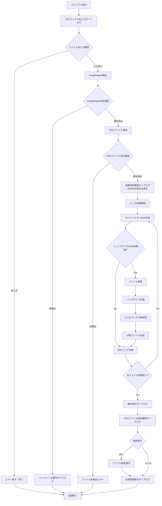

# PNG to PDF 変換ツール 仕様書

## 1. 概要

本アプリケーションは、macOS上でAppleScriptにより実装されたPNG画像からPDF変換ツールです。指定フォルダ内のPNG画像ファイルを一括でPDFファイルに変換する機能を提供し、**200MB自動分割機能**により大容量ファイルも効率的に処理できます。

### 1.1 目的
- スクリーンショット等のPNG画像を効率的にPDF化
- バッチ処理による複数画像の一括変換
- ユーザーフレンドリーなGUIインターフェース
- **200MB制限による自動ファイル分割でファイル管理を最適化**

### 1.2 対象環境
- **OS**: macOS（AppleScript対応バージョン）
- **依存ソフトウェア**: ImageMagick
- **インストール方法**: `brew install imagemagick`

## 2. 機能仕様

### 2.1 基本機能

#### 2.1.1 画像変換機能
- **対象形式**: PNG形式の画像ファイル
- **出力形式**: PDF形式（単一ファイル）
- **変換エンジン**: ImageMagick

#### 2.1.2 バッチ処理機能
- 指定フォルダ内のすべてのPNGファイルを自動検出
- ファイル名順（自然順序）でソート
- 複数画像を単一PDFファイルに結合
- **200MB超過時の自動分割処理**

#### 2.1.3 自動分割機能
- **ファイルサイズ監視**: PDF作成後に自動的にファイルサイズをチェック
- **インテリジェント分割**: 200MB超過時に最適なバッチサイズで再処理
- **動的調整**: バッチサイズを段階的に縮小（10→5→2→1ファイル）
- **連番ファイル命名**: `ファイル名_part1.pdf`, `ファイル名_part2.pdf` 形式

### 2.2 設定パラメータ

#### 2.2.1 固定設定値
| 項目 | 設定値 | 説明 |
|------|--------|------|
| ソースフォルダ | `/Users/gantaku/本/_screenshot/` | PNG画像の入力フォルダ |
| 保存フォルダ | `/Users/gantaku/本/` | PDF出力先フォルダ |
| 画像品質 | 85% | JPEG圧縮品質（1-100） |
| ページサイズ | A4 | 用紙サイズ（A4/Letter/Legal対応） |
| ページフィット | 有効 | 画像をページサイズに合わせて調整 |
| **最大ファイルサイズ** | **200MB** | **PDF分割の閾値（設定変更可能）** |

#### 2.2.2 ユーザー入力項目
- **PDFファイル名**: 実行時にダイアログで入力
- **自動拡張子付与**: `.pdf`拡張子の自動追加
- **分割時命名**: 基準ファイル名から自動的に `_part番号` を付与

### 2.3 ImageMagick検出機能

#### 2.3.1 検索パス優先順位
1. `/opt/homebrew/bin/convert`（Apple Silicon Mac + Homebrew）
2. `/usr/local/bin/convert`（Intel Mac + Homebrew）
3. システムPATH経由（`which convert`）

#### 2.3.2 未検出時の動作
- エラーダイアログを表示
- インストール手順を案内
- 処理を中断

## 3. ユーザーインターフェース

### 3.1 実行フロー



### 3.2 ダイアログ一覧

#### 3.2.1 入力ダイアログ
- **PDFファイル名入力**
  - メッセージ: "保存するPDFのファイル名を入力してください（.pdfは自動です）:"
  - アプリ名: "PDFファイル名の入力"

#### 3.2.2 確認ダイアログ
- **変換設定確認（200MB分割対応）**
  - タイトル: "PNG→PDF変換設定（200MB分割対応）"
  - 内容: ファイル数、品質、ページサイズ、基準ファイル名、最大サイズを表示
  - ボタン: "キャンセル" / "変換開始"

- **進捗表示ダイアログ**
  - メッセージ: "変換中... (X/Y ファイル処理済み)"
  - 大量ファイル処理時（10ファイル超）に表示
  - 自動消去: 1秒後に自動的に消去

- **PNG削除確認**
  - メッセージ: "変換後のPNGファイルをゴミ箱に移動しますか？"
  - ボタン: "いいえ" / "はい"

#### 3.2.3 完了ダイアログ
- **変換完了通知（分割対応）**
  - 作成されたファイル数を表示
  - 各PDFファイルの名前とサイズを一覧表示
  - 保存場所とPNG処理状況を表示
  - 分割が発生した場合は詳細情報を提供

#### 3.2.4 エラーダイアログ
- **ImageMagick未検出エラー**
- **PNGファイル未検出エラー**
- **PDF作成失敗エラー**
- **一般エラー**（エラーメッセージとコード番号を表示）

## 4. 技術仕様

### 4.1 ImageMagick変換コマンド

#### 4.1.1 基本コマンド構造
```bash
# 従来の一括変換
cd [ソースフォルダ] && [convertパス] -quality [品質] -compress jpeg $(ls -1 *.png | sort -V) "[保存パス]"

# 200MB分割対応版（バッチ処理）
cd [ソースフォルダ] && [convertパス] -quality [品質] -compress jpeg [指定ファイル群] "[保存パス]"
```

#### 4.1.2 ページサイズ設定
- **A4**: `-page A4`
- **Letter**: `-page Letter`
- **Legal**: `-page Legal`

### 4.2 ファイル操作

#### 4.2.1 PNG検索
- コマンド: `ls -1 *.png 2>/dev/null | sort -V`
- ソート: 自然順序ソート（-V オプション）

#### 4.2.2 ファイルサイズチェック
- コマンド: `stat -f%z [ファイルパス]`
- 単位変換: バイト数 ÷ 1024 ÷ 1024 = MB
- 闾値比較: 200MBと比較して分割判定

#### 4.2.3 ファイル削除
- Finderアプリケーション経由でゴミ箱に移動
- 拡張子`.png`のファイルを対象

### 4.3 分割処理アルゴリズム

#### 4.3.1 バッチ処理フロー
1. **初期バッチ**: 10ファイルずつ処理
2. **サイズチェック**: PDF作成後200MB超過を確認
3. **分割判定**: 超過時はファイル削除後再処理
4. **サイズ縮小**: バッチサイズを半分に減らす
5. **再帰処理**: 1ファイルまで繰り返し

#### 4.3.2 ファイル命名システム
- **基本パターン**: `[ベース名]_part[番号].pdf`
- **特例**: 10ファイル以下かつ200MB未満の場合は `[ベース名].pdf`
- **連番付与**: part1, part2, part3...の順序で自動付与

#### 4.3.3 メモリ管理
- **一時ファイル清理**: 失敗時に自動削除
- **バッチサイズ制御**: メモリ使用量を最小化
- **遅延処理**: ファイルI/O完了を待機（1秒間隔）

### 4.4 エラーハンドリング

#### 4.4.1 エラー分類
- **-128**: ユーザーキャンセル（特別処理）
- **その他**: 一般エラー（メッセージ・コード表示）

#### 4.4.2 例外処理
- try-catch文によるエラー捕捉
- エラー時のリソース解放
- ユーザーフレンドリーなエラーメッセージ

## 5. 制限事項・注意点

### 5.1 システム制限
- **macOS専用**: AppleScriptはmacOS専用
- **ImageMagick必須**: 事前インストールが必要
- **パス固定**: ソース・保存フォルダは固定
- **単一ファイル制限**: 1ファイルで200MB超過の場合は分割不可

### 5.2 使用上の注意
- フォルダパスが存在しない場合は事前作成
- 大量ファイル処理時は処理時間に注意
- PDF上書き時の確認なし（既存ファイル上書き）
- **分割処理中のディスク容量**: 一時ファイル作成で追加容量が必要
- **分割ファイルの管理**: 連番ファイルの順序を維持

### 5.3 今後の改善点
- 設定ファイル対応による動的設定
- **分割サイズのカスタマイズ対応（現在200MB固定）**
- プログレスバー表示の改善
- ドラッグ&ドロップ対応
- 多言語対応（現在は日本語のみ）
- **分割ファイルの自動マージ機能**

## 6. バージョン情報

### 6.1 基本情報
- **言語**: AppleScript
- **文字エンコード**: UTF-8
- **対応環境**: macOS (AppleScript実行環境)

### 6.2 バージョン履歴
- **v1.0 (基本版)**: 約21KB（コンパイル済み）
  - PNG to PDF基本変換機能
  - ImageMagick連携
  - GUIダイアログ操作

- **v2.0 (200MB分割対応版)**: 約35KB（推定）
  - 200MB自動分割機能を追加
  - インテリジェント分割アルゴリズムを実装
  - 進捗表示機能を追加
  - エラーハンドリングを強化

## 7. ライセンス・利用条件

本仕様書に記載された情報は、実装されたAppleScriptの動作を分析したものです。実際の使用時は、システム環境や依存ソフトウェアのバージョンにより動作が異なる場合があります。